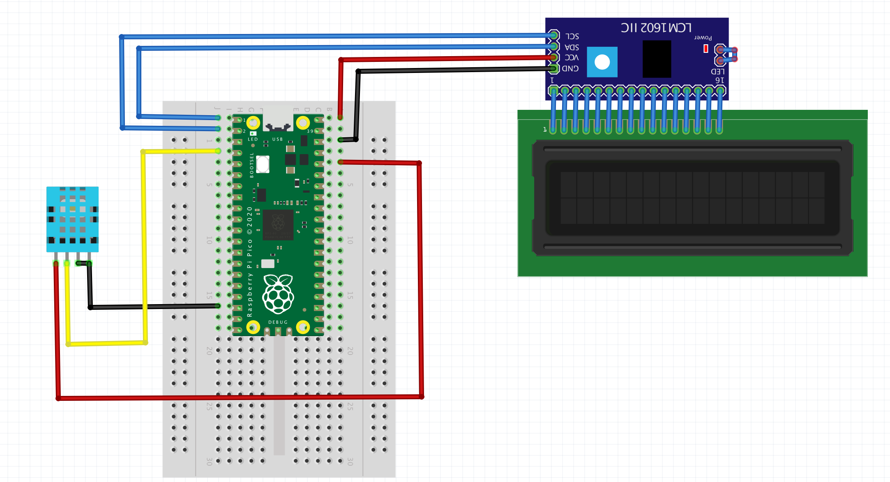

# 🌦️ Réalisation d'une mini station météo

Station météo embarquée mesurant la température et l'humidité ambiantes en temps réel, avec affichage sur écran LCD 16x2 (interface I2C), programmée en MicroPython.

[Bibliothèques](bibliotheques)

## 🎯 Objectifs

- Concevoir une station météo capable de mesurer la température et l'humidité ambiantes.
- Afficher les données en temps réel sur un écran LCD 16x2 avec interface I2C.
- S'initier à la programmation embarquée avec MicroPython.
- Favoriser la compréhension des capteurs numériques et des protocoles de communication.

## 🧰 Matériel nécessaire

| Composant | Description / Rôle |
|-----------------|-----------------|
| DHT11 | Capteur de température et d'humidité |
| Raspberry Pi Pico | Microcontrôleur |
| Écran LCD 16x2 I2C | Affichage des mesures 
| Breadboard + fils | Connexions temporaires |
| Source d'alimentation | USB ou batterie |
## 📖 Théorie et fonctionnement

### DHT11
- Capteur numérique avec sortie série.
- Résolution : 1 °C / 1 % HR.
- Intervalle de mesure : ~1 Hz.
- Communication : signal digital avec timing précis.

### Écran LCD I2C
- Interface simplifiée via bus I2C (2 fils : SDA, SCL).
- Adresse par défaut : `0x27` ou `0x3F`.
- Permet d'économiser des broches GPIO par rapport à une liaison parallèle classique.

## 🔌 Schéma de câblage

### DHT11 → Raspberry Pi Pico
| Broche DHT11 | Broche Pico |
|---|---|
| VCC | 3.3V |
| DATA | GPIO 2 (avec résistance de pull-up 10kΩ vers VCC) |
| GND | GND |

### LCD I2C → Raspberry Pi Pico
| Broche LCD | Broche Pico |
|---|---|
| VCC | 5V |
| GND | GND |
| SDA | GPIO 0 |
| SCL | GPIO 1 |

> Le schéma complet (breadboard) est disponible dans le fichier image du projet (`schema_cablage.png`).

## ⚙️ Installation

1. **Environnement de développement**
   - Installer [Thonny IDE](https://thonny.org/) pour MicroPython.
   - Flasher le firmware MicroPython sur le Raspberry Pi Pico si ce n'est pas déjà fait.

2. **Bibliothèques nécessaires**
   Copier les fichiers suivants (fournis dans le dossier *"Bibliothèque pour la réalisation du projet"*) directement dans la mémoire du Raspberry Pi Pico, **sans les renommer** :
   - `lcd_api.py`
   - `pico_i2c_lcd.py`
   - `LCD_test.py`
   - Bibliothèque `dht` (intégrée à MicroPython)

3. **Test de l'écran LCD**
   Exécuter `LCD_test.py` : le message **"ROBOTIQUE avec MicroPython"** doit s'afficher sur l'écran pour valider la connexion I2C.

## 📚 Bibliothèques

| Fichier | Rôle |
|---|---|
| `dht` | Bibliothèque MicroPython native pour piloter le capteur DHT11 |
| `lcd_api.py` | API générique pour la gestion des écrans LCD (commandes de base) |
| `pico_i2c_lcd.py` | Pilote spécifique pour communiquer avec l'écran LCD via I2C sur le Pico |
| `LCD_test.py` | Script de test d'affichage sur l'écran LCD |

## ▶️ Utilisation

1. Câbler les composants selon le schéma ci-dessus.
2. Copier les bibliothèques sur le Pico.
3. Écrire (ou déployer) le script principal qui :
   - lit la température et l'humidité via le capteur DHT11 (`GPIO 2`),
   - affiche les valeurs sur l'écran LCD I2C (`SDA: GPIO 0`, `SCL: GPIO 1`),
   - rafraîchit la mesure toutes les 1 à 2 secondes.
4. Alimenter le Pico via USB ou batterie : la station météo démarre automatiquement.

## 🚀 Extensions possibles

- Ajout d'un capteur de pression (BMP180, BME280).
- Enregistrement des données sur carte SD.
- Transmission via Wi-Fi (ESP32) vers une interface web.
- Affichage graphique des tendances (matplotlib ou dashboard HTML).
- Boîtier imprimé en 3D pour une station autonome.

## Auteur

**Sèdjro Alban HINVI**
Projet personnel réalisé dans le cadre de mon apprentissage en
Robotique et Système embarqué.